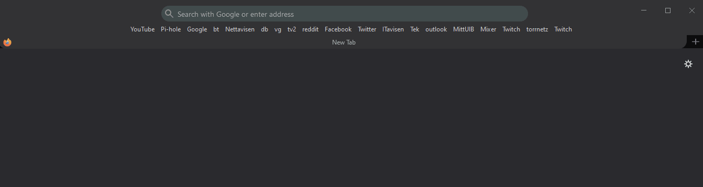

# ./ dotSlashFiles
A place where i keep my settings for different applications

## [userChrome](https://www.userchrome.org/what-is-userchrome-css.html)
By adding one of the [userChrome.css](https://github.com/HenrikHills/dotSlashFiles/tree/master/chrome) files I'm achieving a safari-like look in Firefox.

